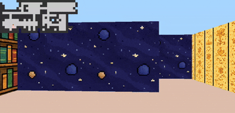

*This project has been created as part of the 42 curriculum by asato, chagen.*

# cub3D


A simple 3D raycasting engine in C using MiniLibX that renders a navigable maze from a 2D map.

---

## 📚 Description

cub3D is a 42 graphics project inspired by *Wolfenstein 3D*.
It parses a `.cub` file, validates the map, and renders a real-time first-person view using raycasting.


---

## 🚀 Features

* Raycasting-based rendering
* Textured walls (N/S/E/W)
* Movement (W/A/S/D) + rotation (←/→)
* Floor and ceiling colors
* Map parsing and validation
* Minimap with vision cone
* Clean error handling

---

## 🏗️ Architecture

**Architecture:** The project follows a modular architecture.
**Includes:** Each file includes only the headers it directly depends on to keep dependencies explicit.
**Ownership:** Modules manage their own resources via dedicated init/cleanup functions, ensuring clear memory ownership. **Cleanup is handled locally:** allocating functions return errors, and callers free partial state.

### Structs
```txt
t_game
├── mlx: void* (display handle)
├── win: void* (window handle)
├── file_path: char* (input file)
├── file_contents: char** (raw file lines)
├── config: t_config
│   ├── texture_paths: char** (NO/SO/WE/EA texture paths)
│   ├── floor: int[3] (RGB)
│   └── ceiling: int[3] (RGB)
├── map: t_map
│   ├── grid: char** (2D map)
│   ├── height, width: int
│   ├── start_pos: t_pos
│   └── start_orientation: char
├── exec: t_exec
└── minimap: t_data

t_exec
├── wall_texture: t_data* (loaded NO/SO/WE/EA textures)
├── scre: t_data
│   ├── img: void* (image buffer)
│   ├── addr: char* (pixel address)
│   └── bpp, line_length, endian: int
├── draw_start, draw_end, wall_height: int
├── ceiling, floor: unsigned int
└── play: t_play
    ├── pos, dir, plane, ray, delta_dist, side_dist: t_vec
    ├── map: t_pos
    ├── step: t_pos
    ├── wall_hit: t_bool
    ├── side: t_direction
    ├── perp_wall_dist: double
    └── texture_col: int
```
---

## 🛠️ Instructions 
#### build:
```bash
make
```

#### run:
```bash
./cub3D maps/valid/valid1.cub
```
The .cub - file must provide the paths to wall textures, floor and ceiling colors and a map with only the characters: 0, 1, W, S, E and N. The map has to be surrounded by walls (1).
For more detailed requirements check the 42 cub3D-subject version 12.0.

#### play: 🎮 Controls:

* **W/A/S/D** → Move
* **←/→** → Rotate
* **ESC** → Exit

---

## 📚 Resources
- Ai was used to 
	- help writing this readme file.
	- find typos.
	- research coding best practices like for example the minimal includes approach.
	- suggest tests for specific functions.
- Resource about LeakSanitizer [MaskRay](https://maskray.me/blog/2023-02-12-all-about-leak-sanitizer).
- Resource on Raycasting: [Gitbook](https://lodev.org/cgtutor/raycasting.html).
- [32 pixel floral wall textures](https://oxymoron-nonsense.itch.io/wildflower-assets)
- [64pixel wall textures](https://normalmap-games.itch.io/pixelated-textures-asset-pack)
